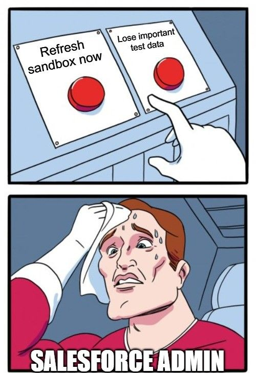

# Journal — 2025-09-28 — Day 4: Chinook Presentation & OULAD Pipeline  

---

## 1) What I learned  
- Importance of **presenting** insights, not just building queries T^T
- Working with the **Chinook database**  
- How teamwork accelerates problem-solving in the **OULAD pipeline**  
- Confidence grows when I focus on **progress over perfection**  

---

## 2) New Vocabulary  
| Term | My Own Words |
|------|--------------|
| **Data Pipeline** | Steps that move and transform raw data into usable form |
| **Collaboration Debt** | The cost of not sharing work or knowledge early enough |
| **Data Storytelling** | Presenting data in a way that’s clear, useful, and relatable |

---

## 3) Data Engineering Mindset Applied  
> “It’s not just about answers—it’s about how you share them.”  
- Queries show logic, but **presentations show value**  
- Pipelines look complex, but **teamwork breaks them down**  

---

## 4) Decisions & Assumptions  
- Chose to focus on top-value business questions (e.g., revenue by genre, customer segmentation) for Chinook
- Focused on clarity in presentation, not just correctness  
- Chose teamwork over going solo → faster debugging and better output  

---

## 5) Open Questions  
- How do I balance **technical accuracy** with **clear storytelling**?  
- What’s the best way to practice presenting SQL queries for real-world stakeholders/ non techy hooman?  

---

## 6) Next Actions  
- [ ] Normalize OULAD dataset into 3NF → prepare for dimensional modeling
- [ ] Improve our Metabase dashboards to be more story-driven, not just data-driven 
- [ ] Practice explaining queries to a non-technical audience  

---

## 7) Artifacts & Links  
- [Chinook DB](https://github.com/lerocha/chinook-database)
- [Metabase - G2 Dashboard](../assets/Metabase%20-%20G2%20Dashboard.pdf)
- [Chinook-Documentation] (https://github.com/shieryl-ryle/ftw-de-bootcamp/tree/dimensional-modeling-project/Documentations/ChinookDocs)
- [OULAD Dataset](https://archive.ics.uci.edu/dataset/349/open+university+learning+analytics+dataset)

---

### Mini Reflection  
Today felt like a big step. Working on Chinook and presenting to Ms. Cara made me see that presenting is just as important as building—it’s not only about writing the right SQL, but also about sharing the story behind it.  

The OULAD pipeline looked intimidating at first, but with everyone pitching in, we got it moving. That reminded me that I don’t need to have all the answers, as long as I know how to lean on teamwork and keep going.  

I think I slipped up today, but we’re still in the experimental stage, so I’m taking it as a learning moment. What matters is making sure I don’t repeat the same mistake. It felt shaky, but I know these early stumbles are part of the process and will help me grow.  

---

### BONUS: Meme of the Day  
  
